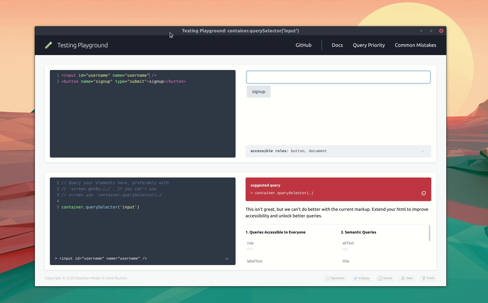

<div align="center">
  <h1>Testing-Playground</h1>
  
  [][emojione]

Simple and complete DOM testing playground that encourage good testing
practices.

[**online playground**][playground] | [next version][playground-next]

</div>

<hr />

<!-- ALL-CONTRIBUTORS-BADGE:START - Do not remove or modify this section -->
[](#contributors-)
<!-- ALL-CONTRIBUTORS-BADGE:END -->

**Playground for [testing-library/dom]**



Testing-Library makes it easy to get started with testing. But even then, it can still be challenging to find the right queries or to understand why an element isn't being matched.

Testing-Playground provides you with direct feedback. Trying to visualize the direct impact of adding and removing specific (aria) attributes. All to give you some visual support while learning about the importance of aria roles, labels, and attributes.

## Embedding

[Testing-Playground][playground] can also be embedded. There is are two embed modes. Manual integration, and `oembed`.

### Oembed

To get started with `oembed`, you'll simply need to copy / paste your direct playground links into a supporting platform.

### Manual integration ([demo][embed-demo])

Follow the following steps if you wish to have an interactive playground on your website.

Add the following snippet directly before your closing `</body>` tag:

```html
<script async src="https://testing-playground.com/embed.js"></script>
```

Create a template element, in which you add to `script` tags. One for `html` and one for `javascript`. Make sure to type them correctly, as that's what our embedder uses to populate the different panes.

Note that the `data-testing-playground` attribute is required as well.

```html
<template data-testing-playground>
  <script type="text/html"></script>

  <script type="text/javascript"></script>
</template>
```

Now, you can populate the `html` and `javascript` elements:

```html
<template data-testing-playground>
  <script type="text/html">
    <button>one</button>
  </script>

  <script type="text/javascript">
    screen.getByRole('button');
  </script>
</template>
```

#### options

To configure your playground even further, add one or more of the following attributes to your opening `<template>` tag. Note, don't remove the `data-testing-playground` attribute!

| attribute    | type                                               | default                                  | description                                     |
| ------------ | -------------------------------------------------- | ---------------------------------------- | ----------------------------------------------- |
| data-panes   | [markup &#124; preview &#124; query &#124; result] | ['markup', 'preview', 'query', 'result'] | which panes to show, and in what order          |
| data-height  | number &#124; string                               | 300                                      | height of the element                           |
| data-width   | number &#124; string                               | '100% '                                  | width of the element                            |
| data-loading | eager &#124; lazy                                  | 'lazy'                                   | load the frame eager or lazy (see iframe specs) |

## Roadmap

Future ideas are maintained in [roadmap.md]. Please use the [issue tracker] to discuss any questions or suggestions you have.

Every section in the roadmap is accompanied by one or more issues. Contributions are most welcome!

## Contributing

Please see [contributing.md] for more details. If you just want to run the playground on your own machine, go to your terminal and enter the following commands:

```bash
git clone git@github.com:testing-library/testing-playground.git
cd testing-playground
npm ci
npm run start
```

## Contributors

Thanks goes to these people ([emoji key][emojis]):

<!-- ALL-CONTRIBUTORS-LIST:START - Do not remove or modify this section -->
<!-- prettier-ignore-start -->
<!-- markdownlint-disable -->
<table>
  <tr>
    <td align="center"><a href="https://github.com/smeijer"><br /><sub><b>Stephan Meijer</b></sub></a><br /><a href="#ideas-smeijer" title="Ideas, Planning, & Feedback">🤔</a> <a href="https://github.com/testing-library/testing-playground/commits?author=smeijer" title="Code">💻</a> <a href="#infra-smeijer" title="Infrastructure (Hosting, Build-Tools, etc)">🚇</a> <a href="#maintenance-smeijer" title="Maintenance">🚧</a></td>
    <td align="center"><a href="https://github.com/marcosvega91"><br /><sub><b>Marco Moretti</b></sub></a><br /><a href="https://github.com/testing-library/testing-playground/commits?author=marcosvega91" title="Code">💻</a> <a href="https://github.com/testing-library/testing-playground/commits?author=marcosvega91" title="Tests">⚠️</a> <a href="https://github.com/testing-library/testing-playground/commits?author=marcosvega91" title="Documentation">📖</a></td>
    <td align="center"><a href="http://timdeschryver.dev"><br /><sub><b>Tim Deschryver</b></sub></a><br /><a href="https://github.com/testing-library/testing-playground/commits?author=timdeschryver" title="Code">💻</a></td>
    <td align="center"><a href="https://kentcdodds.com"><br /><sub><b>Kent C. Dodds</b></sub></a><br /><a href="#ideas-kentcdodds" title="Ideas, Planning, & Feedback">🤔</a></td>
    <td align="center"><a href="https://michaeldeboey.be"><br /><sub><b>Michaël De Boey</b></sub></a><br /><a href="https://github.com/testing-library/testing-playground/commits?author=MichaelDeBoey" title="Code">💻</a></td>
    <td align="center"><a href="https://github.com/delca85"><br /><sub><b>Bianca Del Carretto</b></sub></a><br /><a href="https://github.com/testing-library/testing-playground/commits?author=delca85" title="Code">💻</a></td>
    <td align="center"><a href="http://gerritalex.de"><br /><sub><b>Gerrit Alex</b></sub></a><br /><a href="https://github.com/testing-library/testing-playground/commits?author=ljosberinn" title="Code">💻</a> <a href="https://github.com/testing-library/testing-playground/commits?author=ljosberinn" title="Tests">⚠️</a></td>
  </tr>
  <tr>
    <td align="center"><a href="https://www.guzy.dev"><br /><sub><b>Dominik Guzy</b></sub></a><br /><a href="https://github.com/testing-library/testing-playground/commits?author=Siemko" title="Code">💻</a></td>
    <td align="center"><a href="https://github.com/connorProgrammes"><br /><sub><b>ConnorProgrammes</b></sub></a><br /><a href="https://github.com/testing-library/testing-playground/commits?author=connorProgrammes" title="Documentation">📖</a> <a href="https://github.com/testing-library/testing-playground/commits?author=connorProgrammes" title="Code">💻</a></td>
    <td align="center"><a href="https://twitter.com/JacobMGEvans"><br /><sub><b>Jacob M-G Evans</b></sub></a><br /><a href="https://github.com/testing-library/testing-playground/commits?author=JacobMGEvans" title="Code">💻</a></td>
    <td align="center"><a href="https://github.com/sumeesh879"><br /><sub><b>Sumeesh Nagisetty</b></sub></a><br /><a href="https://github.com/testing-library/testing-playground/pulls?q=is%3Apr+reviewed-by%3Asumeesh879" title="Reviewed Pull Requests">👀</a></td>
    <td align="center"><a href="http://www.linkedin.com/in/flaviohfreitas"><br /><sub><b>Flávio H Freitas</b></sub></a><br /><a href="https://github.com/testing-library/testing-playground/commits?author=flaviohenriquecbc" title="Code">💻</a></td>
  </tr>
</table>

<!-- markdownlint-enable -->
<!-- prettier-ignore-end -->
<!-- ALL-CONTRIBUTORS-LIST:END -->

This project follows the [all-contributors][all-contributors] specification.
Contributions of any kind welcome!

[testing-library/dom]: https://testing-library.com/docs/dom-testing-library/example-intro
[playground]: https://testing-playground.com
[playground-next]: https://develop.testing-playground.com
[embed-demo]: https://codepen.io/smeijer/pen/yLYWZmK
[roadmap.md]: https://github.com/testing-library/testing-playground/blob/master/ROADMAP.md
[contributing.md]: https://github.com/testing-library/testing-playground/blob/master/CONTRIBUTING.md
[issue tracker]: https://github.com/testing-library/testing-playground/issues
[all-contributors]: https://github.com/all-contributors/all-contributors
[emojis]: https://github.com/all-contributors/all-contributors#emoji-key
[emojione]: https://www.emojione.com/emoji/1f9e
